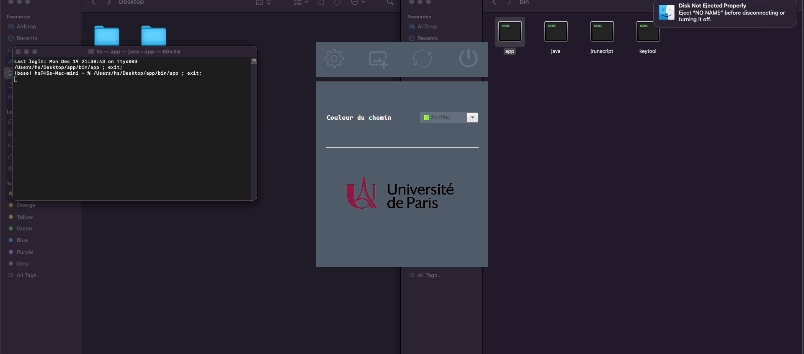
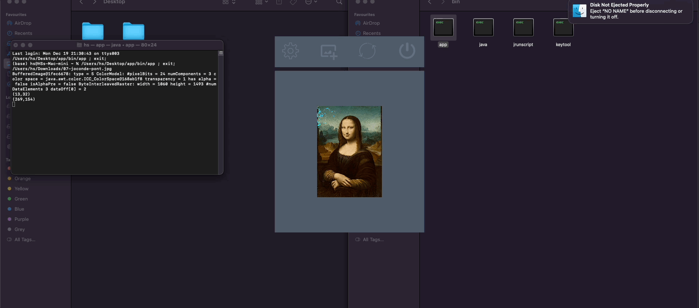

# Projet Algorithmique Avancée
Ce programme permet d'obtenir le plus court chemin entre 2 pixels. La distance entre 2 pixels est évaluée par la différence des valeurs binaires des RGBA (Rouge Vert Bleu Alpha) de ces 2 pixels. Le plus court chemin est calculé avec l'algorithme de Dijkstra. Il est implémenté en java à l'aide d'une PriorityQueue qui traite les pixels voisins du pixel courant. L'interface graphique a été réalisée avec JavaFX et CSS. 

### Démo recherche du plus court chemin 
 

### Démo de l'interface utilisateur 
 

